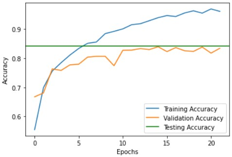

  
# TinyML :cake:

### Implementazione di una rete neurale su scheda [OpenMV Cam H7 Plus](https://www.polimarcheracingteam.com/it/) per il corso di Sistemi Embedded 2022/2023:

# Specifiche

* **Hardware:** OpenMV Cam H7 Plus
* **Dataset:** [Food-101](https://data.vision.ee.ethz.ch/cvl/datasets_extra/food-101/)
* **Libreria:** TensorFlow/Keras
* **Ambiente:** Google Colab, OpenMV IDE

# Descrizione

La rete neurale convoluzionale è stata addestrata per **classificare** immagini da **3** diverse classi di cibo:

* **torta di mele** (apple pie)
* **costine** (baby back ribs)
* **baclava** (baklava)

e lo fa con una **accuratezza** di circa il **70%**.

# Utilizzo
