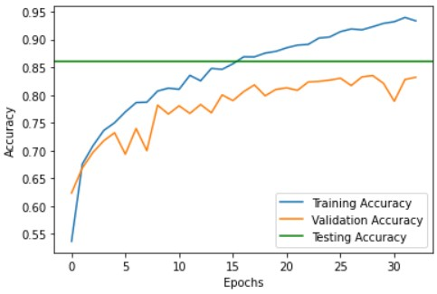

  
# TinyML :cake:

### Implementazione di una rete neurale su scheda [OpenMV Cam H7 Plus](https://www.polimarcheracingteam.com/it/) per il corso di Sistemi Embedded 2022/2023:

# Specifiche

* **Hardware:** OpenMV Cam H7 Plus
* **Dataset:** [Food-101](https://data.vision.ee.ethz.ch/cvl/datasets_extra/food-101/)
* **Libreria:** Keras, TensorFlow
* **Ambiente:** Google Colab, OpenMV IDE
* **Linguaggio:** Python

# Descrizione

La rete neurale convoluzionale è stata addestrata per **classificare** immagini da **3** diverse classi di cibo:

* **pizza**
* **spaghetti carbonara**
* **tiramisù**

e lo fa con una **accuratezza** di oltre l'**80%**.

# Utilizzo

In entrambi i casi spiegati sotto è fondamentale spostare il modello *food101.tflite* nella microSD della scheda.

## Immagini caricate in memoria

Nella cartella [test](https://github.com/ingtommi/TinyML/tree/main/test) si trovano [script](https://github.com/ingtommi/TinyML/blob/main/test/test_script.py) e immagini per testare la rete neurale senza acquisire immagini dal sensore.

*NOTA:* le immagini vanno caricate nella microSD!

## Immagini acquisite in tempo reale

Se si vuole lavorare col sensore come in [video](https://github.com/ingtommi/TinyML/blob/main/media/video.mp4) basta lanciare l'altro [script](https://github.com/ingtommi/TinyML/blob/main/script.py).

*NOTA:* la latenza nel video è più alta di quella che si dovrebbe avere perchè questo è stato girato con una versione precedente del modello!
